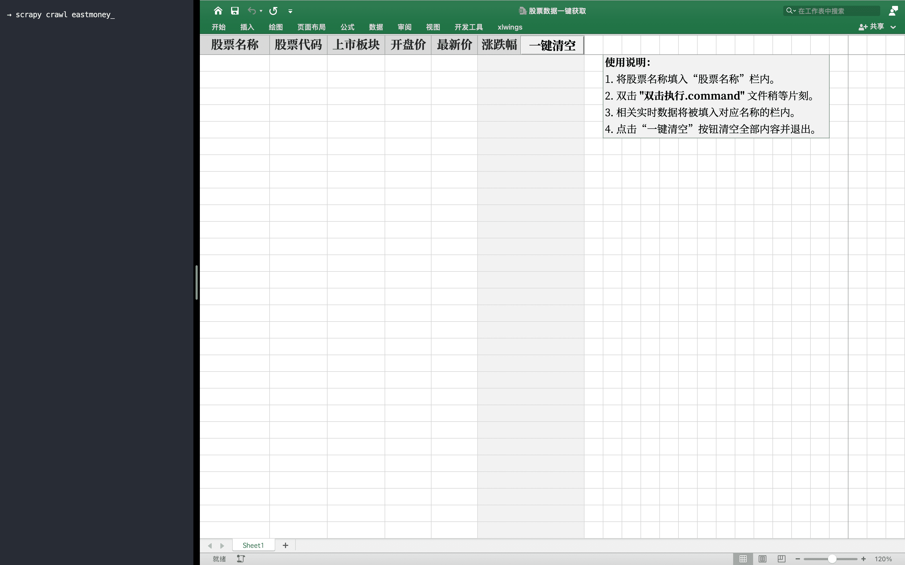

# 股票数据一键获取

1. 开发技术：**Excel VBA** <small>(macOS)</small> + **xlwings** + **Scrapy**。

2. 安装使用。

   - 安装 [**Python3**](https://www.python.org/downloads/) 环境。

     ```shell
     #设置默认版本
     echo 'alias python="/usr/local/bin/python3"' >> ~/.bash_profile
     echo 'alias pip="/usr/local/bin/pip3"' >> ~/.bash_profile
     ```

   - 安装 [**xlwings**](https://docs.xlwings.org/en/stable/installation.html#id2) 插件。

     ```shell
     #Python
     pip install xlwings
     #Excel
     xlwings addin install
     ```
     
     引用 xlwings 函数库。（**VBE - 工具 - 引用 - xlwings - 确定**）
     
   -  安装 [**Scrapy**](https://scrapy.org/download/) 相关插件。

      ```shell
      pip install scrapy
      pip install scrapy-selenium
      pip install scrapy-splash
      ```

   - 安装 [**Selenium**](https://www.selenium.dev/) 插件。

     ```shell
     pip install selenium
     ```

   - 安装 Chrome 浏览器及其驱动程序。

     确认浏览器[**[版本号]**](chrome://settings/help)，替换链接中对应版本点击下载。

     [**https://chromedriver.storage.googleapis.com/[版本号]/chromedriver_mac64.zip**](https://chromedriver.storage.googleapis.com/index.html)

     解压后将其中的 **chromedriver** 移动到 PATH 目录。

     ```shell
     cp chromedriver /usr/local/bin/
     ```

3. 打开 [**“股票数据一键获取.xlsm”**](股票数据一键获取.xlsm) 按使用说明操作即可。

    
